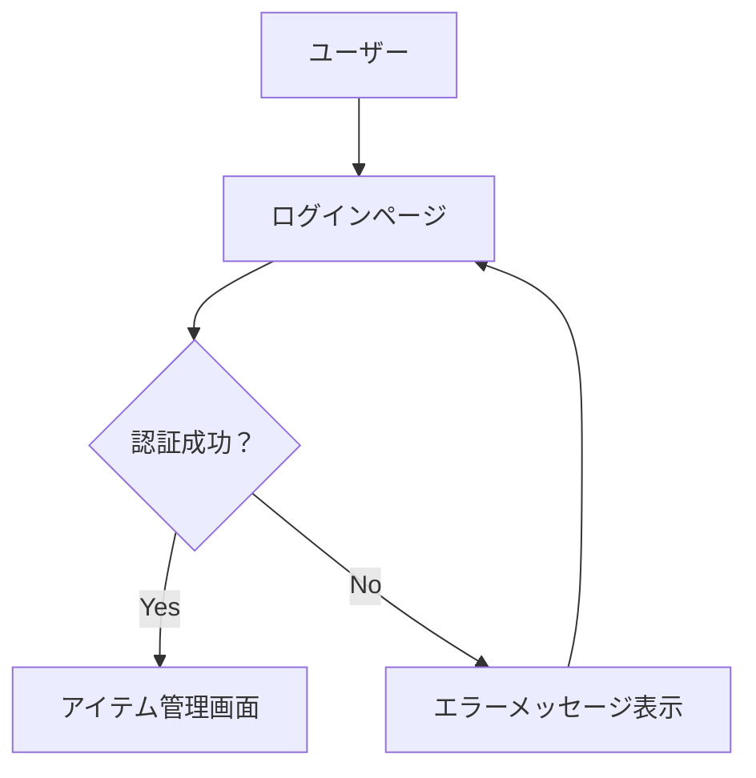
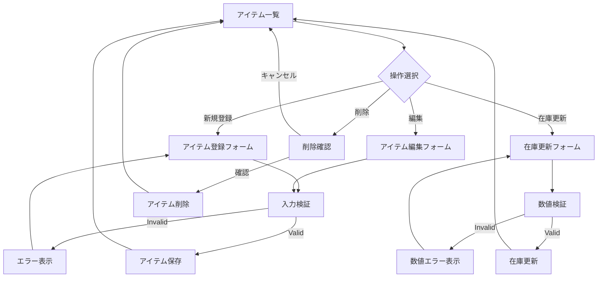
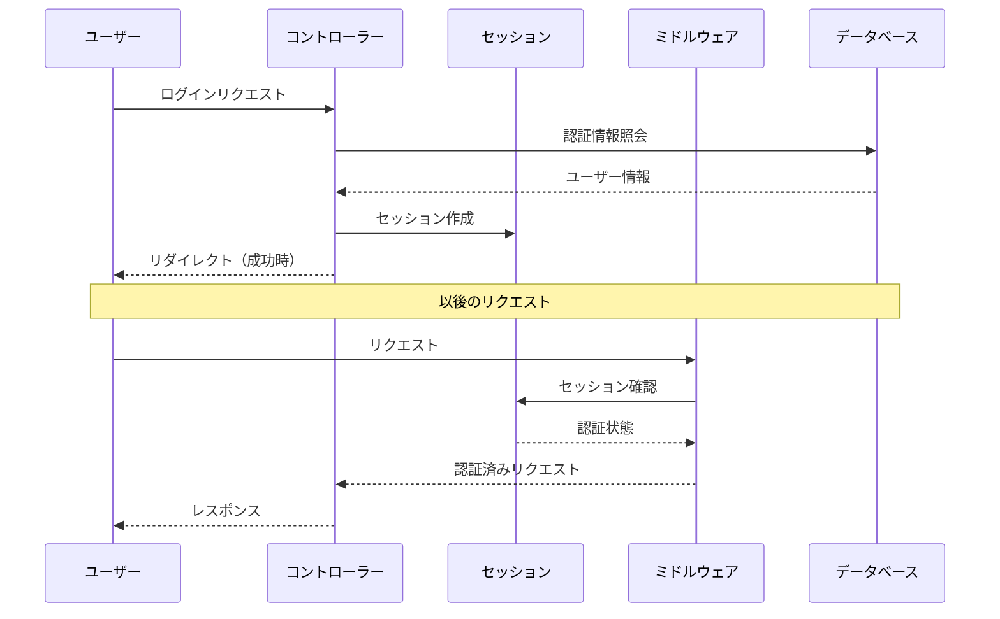
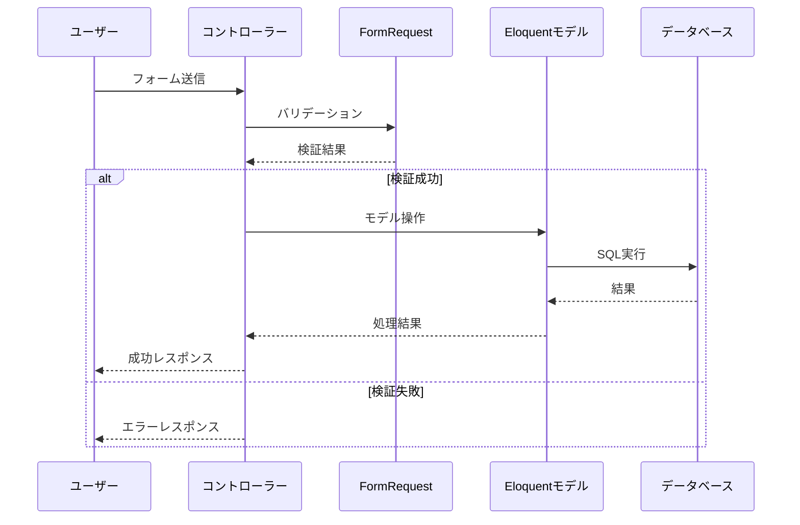
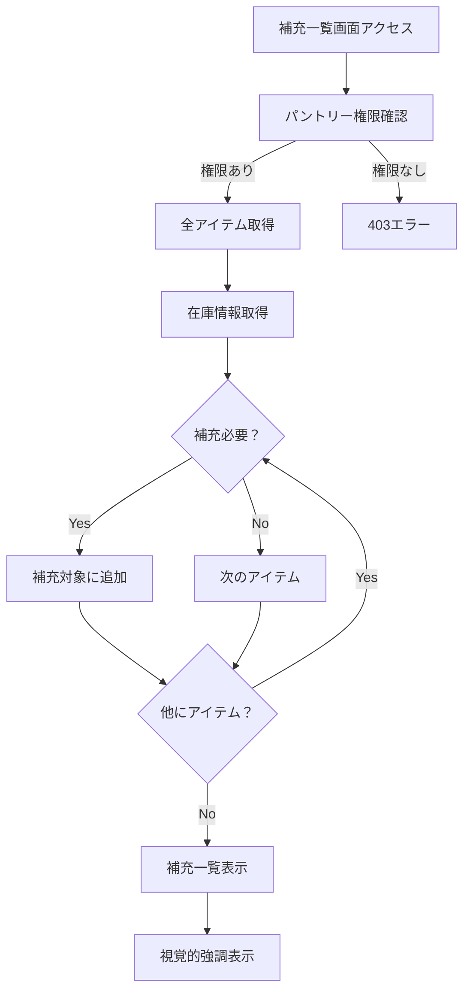
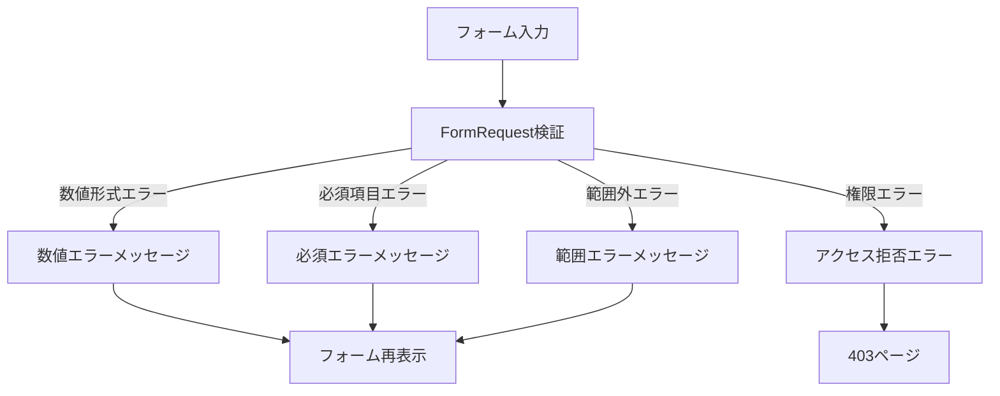
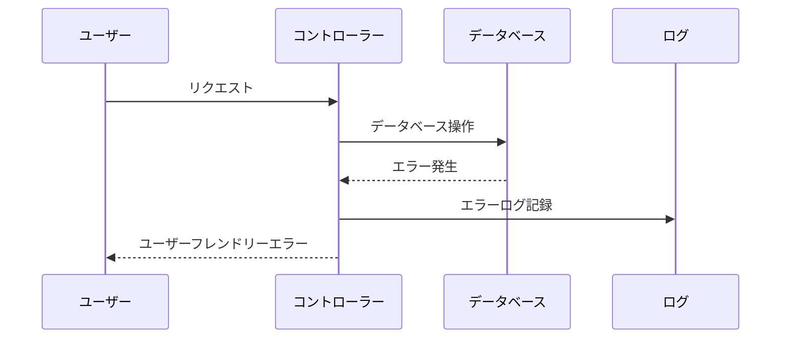
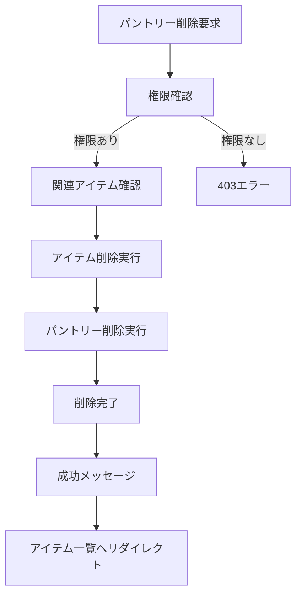
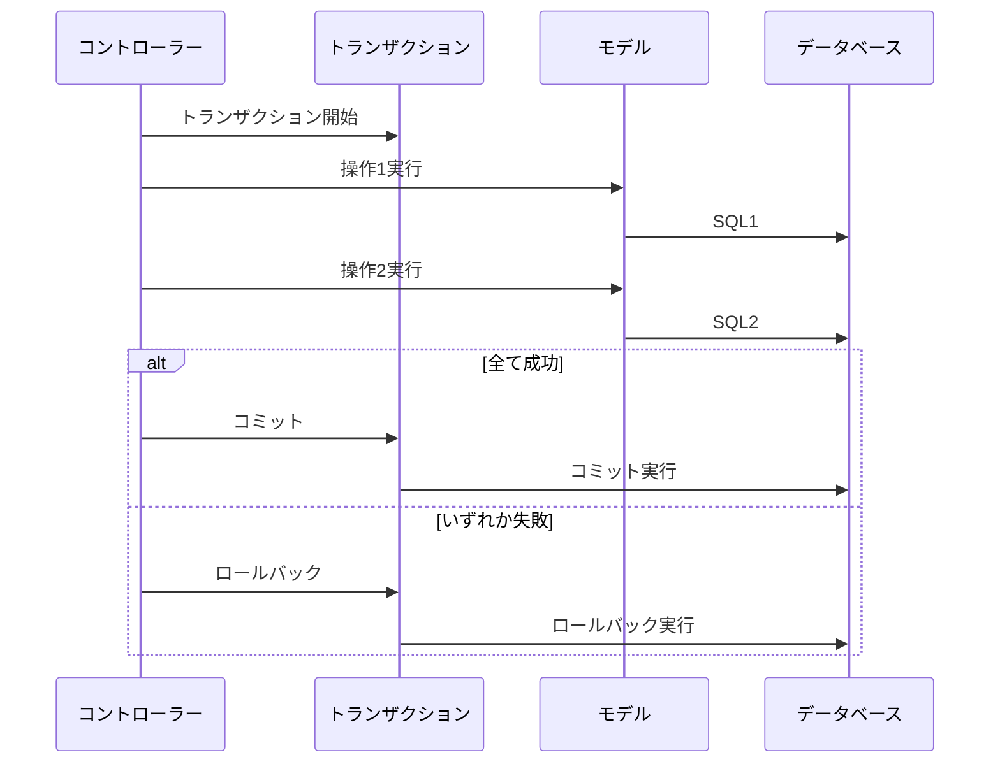

# データフロー図

## ユーザーインタラクションフロー

### メイン認証フロー

### アイテム管理フロー

## データ処理フロー

### 認証・認可フロー

### CRUD 処理フロー

### 補充必要アイテム判定フロー

## エラーハンドリングフロー

### 入力検証エラー

### システムエラー処理

## データ整合性保証フロー

### カスケード削除

### トランザクション管理

